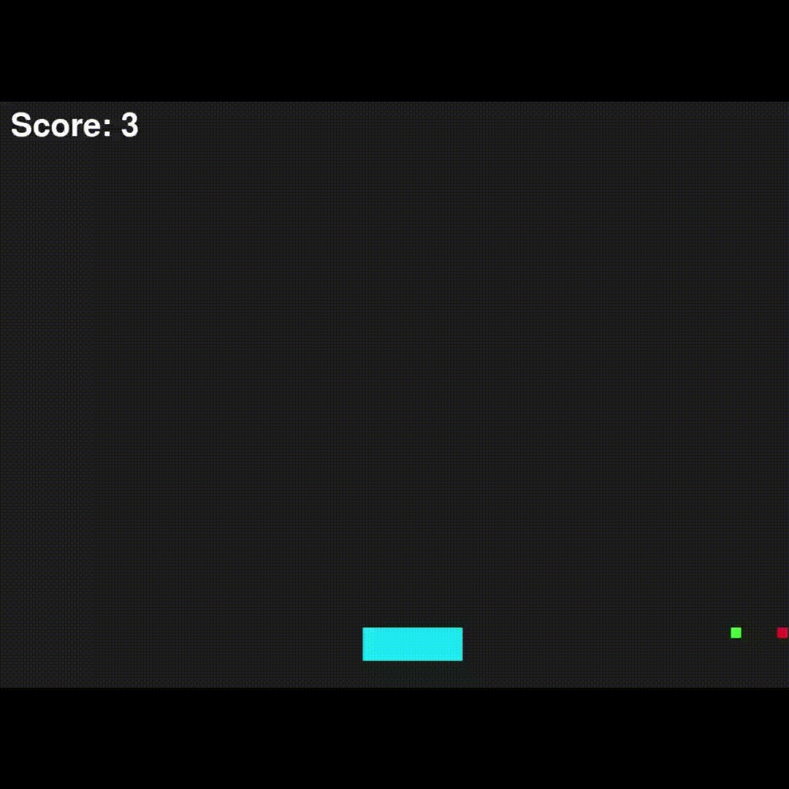

# in-rl-we-trust

A curated playground of Reinforcement Learning (RL) projects and experiments. This repository combines multiple small, self-contained RL implementations — from classic control problems to modern deep RL techniques — designed for learning, prototyping, and comparing algorithms.

---

## Overview

**in-rl-we-trust** explores how RL agents can learn, adapt, and solve a variety of custom-built game environments. The core idea is simple:

**Create small, intuitive games — then teach machines how to master them.**

Perfect for students, researchers, and anyone looking for a hands-on RL playground.

---

## What’s Inside ?

### 1. Custom Pygame Environments
- Lightweight, easy-to-understand environments built using Pygame.
- Designed to be simple for humans, yet non-trivial for RL agents.
- Fully customizable: deterministic or stochastic depending on the experiment.

### 2. RL Agent Implementations
- Each environment includes one or more RL agents:
  - Q-Learning
  - SARSA
  - Deep Q-Networks (DQN)
  - Policy Gradient Agents
  - Actor–Critic Variants
  - Custom planners or heuristic agents
- Provided with:
  - Training scripts
  - Evaluation scripts
  - Reward analysis
  - Pretrained models

### 3. Tutorials
Step-by-step guides on:
- Building a Pygame environment
- Defining state and action spaces
- Creating reward functions
- Training RL agents
- Visualizing and logging training performance

---

## 🕹 Current Environments

### 1️⃣ Cart Game
- Horizontal movement game:
  - Player moves a cart to collect objects
  - Score increases with movement and object collection
- Features:
  - Boundary conditions
  - Collision detection
  - Random object spawning
- RL Challenges:
  - Sparse rewards
  - Continuous action space
  - Exploration vs. exploitation
  - Time-penalized movement strategies

📁 Folder: `cart_game/`

---

## 🚧 Coming Soon
- Inverted Pendulum Simulator
- Pong-like RL Playground
- Gridworld Variants
- Obstacle Avoidance Environment
- Autonomous Driving Mini-Sim
- Multi-agent environments  
- Corresponding RL agents for each

---
## 📦 Repository Structure

A high-level overview of the project folders and their contents:

- **cart_game/** — Implementation of the Cart game environment, RL agents, and related assets  
  - `cart_game.py` — Main environment script  
  - `agent_dqn.py` — Deep Q-Network agent  
  - `agent_qlearning.py` — Q-Learning agent  
  - `README.md` — Environment-specific documentation  
  - `assets/` — Images, sprites, and other assets used by the environment

- **pendulum_game/** — Inverted pendulum environment (coming soon)  

- **utils/** — Helper modules and utilities for RL experiments  
  - `replay_buffer.py` — Experience replay buffer  
  - `neural_networks.py` — Neural network architectures  
  - `wrappers.py` — Environment wrappers  
  - `plotting.py` — Visualization tools

- **notebooks/** — Jupyter notebooks for analysis and visualization  
  - `Training_Analysis.ipynb` — Performance and reward analysis  
  - `Agent_Visualization.ipynb` — Visualization of agent behavior

- **README.md** — Main project documentation  

---

## 📩 Contact

If you're interested in robotics, RL, or simulations, feel free to reach out.  
Happy to collaborate or discuss ideas!
